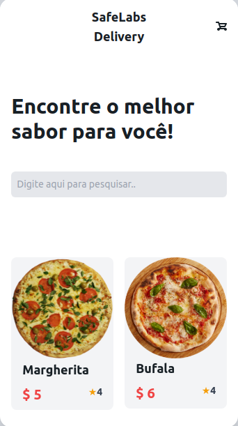
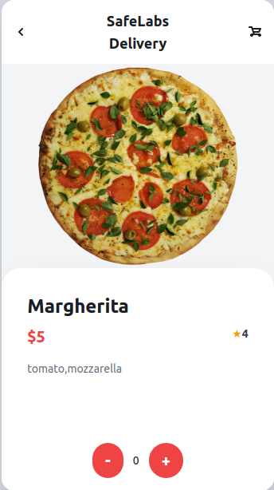
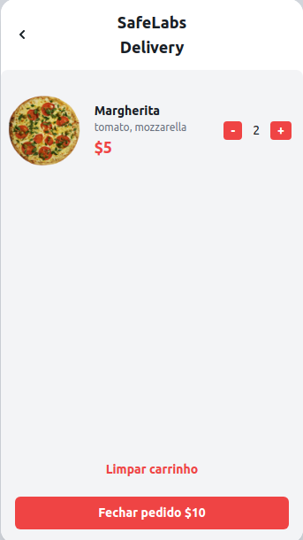
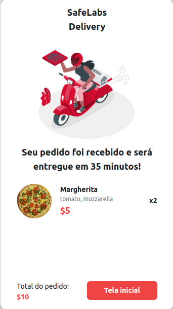

# SafeLabs Delivery


### Instruções para executar o projeto


Instale as dependências do projeto utilizando o seguinte comando:
```
$ npm install
```

Então, execute o comando abaixo para executar a aplicação:
```
$ npm run start
```

### Melhorias futuras

- O campo de pesquisa da aplicação pois um problema. Ao adicionar um nome que não existe a apagar não é renderizado o conteudo de todas as pizzas.

- Usar o localstorage do navegador ou o react redux para melhorar o state da aplicação.

- Melhorar o roteamento de telas.


### Screenshots




